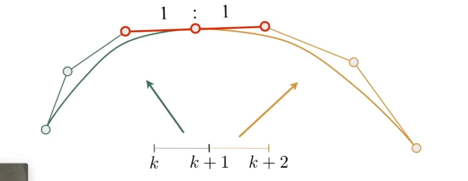

# Geometry

## Implicit Representations of Geometry

It's based on classifying points which satisfy some specified relationship

E.g. sphere：all points in 3D, where $x^2 + y^2 + z^2 = 1$

It's easy to test whether a point is inside the object by using the function

We can use boolen operation to get more geometries

### Distance Function

The minimum distance from a point in 3-D space to the geometry

Gradually blend surface together using distance functions

## Level Set

The distance function is stored in a grid

## Fractaks

Similar to recursion

## Explicit Representations of Geometry

All points are **given directly** or **via parameter mapping**

Inside test will be hard

### Point Cloud

Demonstrate points with high density in the graph

Useful for **large** datasets (>> 1 point/pixel)

Often converted into polygen mesh

Difficult to draw

### Polygen Mesh

Store vertices and polygens (often triangles or quads)

Easier to do processing/simulation, adaptive sampling

More complicated data structures

**Most common medthod in CG**

#### The Wavefront Object File (.obj) Format

A text file that specifies vertices, normals, texture coordinates and **their connectiveties**

f a/b/c : a = vertex, b = texture coordinates, c = normal

## Curves

### Bézier Curves

#### Define Cubic Bézier Curve With Triangles

The start tangent and the end tangent can decide the only one curve

#### de Casteljau Algorithm

##### Quadratic Bézier

Consider **three** points

Insert a point using linear interpolation

Find the $b^1_0$ in t/1 point in the line $b_0 b_1$ and $b_1^1$ in t/1 point in $b_1 b_2$, and finally we decide the point of curve in the time **t** in $b_0^2$ in t/1 point in $b_0^1 b_1^1$

We can get all points  for time $t \in [ 0 , 1 ]$ in this way

##### Cubic Bézier

Similar to quadratic

#### Evaluating Bézier Curves Algebratic Formula

A pyramid of coefficients

We get quadratic point in this way

$$ b_0^1 ( t ) = ( 1 - t ) b_0 + t b_1 
\\ b_1^1 ( t ) = ( 1 - t ) b_1 + t b_2 
\\ b_0^2 ( t )= (1 - t ) b_0^1 + t b_1^1
\\ b_0^2 ( t ) = ( 1 - t )^2 b_0 + 2 t ( 1 - t ) b_1 + t^2 b_2$$

##### Bernstein Form of a Bézier Curve of Order n

$$ b^n ( t ) = \sum \limits_{j = 0}^{ n } b_j B_j^n ( t )$$

It represent a binomial distribution

$$ B_i^n ( t ) = \tbinom{ n }{ i } t^i ( 1 - t) ^{ n - i }$$

#### Properties of Bézier Curve

1. Interpolates endpoints
   
    For cubic Bézier : $ b ( 0 ) = b_0 ; b ( 1 ) = b_3$
2. Tangent to end segments
   
    Cubic case: $ b^{'} ( 0 ) = 3 ( b_1 - b_0) $ ; $b^{'} ( 1 ) = 3 ( b_3 - b_2 )$
3. Affine transformation property
   
    Transform curve by transforming control points

    After the affine transformation the shape of the curve will be the same

    This is not established in projection
4. Convex hull property
 
    Curve is within convex hull of control points

    Convex hull is similar to the elastic fixed by some poles

    

#### Piecewise Bézier Curves

We draw the higher-order Bézier curves by chaining many low-order Bézier curves

**Piecewise cubilc Bézier** is the most common technique, drawing the curve every four points

To get a smooth curve, the end control pole of one curve and the start pole of the next curve must in the same direction and the length should be the same

##### Continuity
If the two curves only connect with each other:

$ C^0 $ continuity: $a_n = b_0$

If they have continuity in first derivative:

$ C^1 $ continuity: $ a_n = b_0 = \frac{1}{2} ( a_{n-1} + b_1 ) $

### Other Type of Splines

**Spine**: a continuous curve constructed so as to pass through a given set of points and have a certain number of continuous derivatives which is a curve that can be controlled by human

#### B-splines (Basis Splines)

Require more information than Bézier curves and satisfy all properties of Bézier curves

B-spline can influence the curve locally instead of changing the curve globally by moving the control poles

## Surfaces

### Bézier Surfaces

Extend Bézier curves to surfaces 

We use 4 $ \times $ 4 control points , getting four curves by using every four points in the same direction

Then we use the four level points in four curves to get a curve

After drawing all curves it will form a surface

#### Evaluating Surface Position For Parameters (u,v)

Find u/t point in four curves and form a new curve, then find the v/t point in the new curve

### Mesh Operations: Geometry Processing

#### Mesh Subdivision (Upsampling)

Use more meshes to increase resolution

##### Loop Subdivision

First create more triangles then tune their positions

Split each triangle into four and assign new vertex positions according to weights

The new and old vertices are updatad differently

###### New Vertex

The white vertex in the middle is a new vertex

The shared vertices are A and B, the rest vertices are C and D

Update to:

$$ 3 / 8 * ( A + B ) + 1 / 8 * ( C + D) $$

###### Old Vertex

Update to:

$$ ( 1 - n * u ) * original \_ position + u * neighbor \_ position \_ sum \\ n = vertex degree \\ u = 3 / 16 \  if \ n = 3 , 3 / (8n) otherwise$$

##### Catmull-Clark Subdivision (General Mesh)

Non-quad face: not a rectangle

Extraordinary vertex: degree is not 4

Step:
    1. Add vertex in each face
    2. Add midpoint on each edge
    3. Connect all new vertices

All the non-quad faces disappear

Loop can only be used in triangle surfaces while CC can be used in any surface

#### Mesh Simplification (Downsampling)

Use less meshes to decrease resolution and try to preserve the orignal shape

##### Edge Collapse

###### Quadric Error Metrics

New vertex  should minimize its sum of square distance (L2 distance) to previously related triangle planes

L2 distance: The sum of square of the distance from the new vertex to all the old vertices

1. Approximate distance to surface as sum of distances to planes containing triangles
2. Iteratively collapse edge with smallest score
3. Use heap to dynamicly update the vertices 
 

#### Mesh regularizeton

Prevent the appearance of special triangles and the ideal case is that all of the triangles are regular triangle