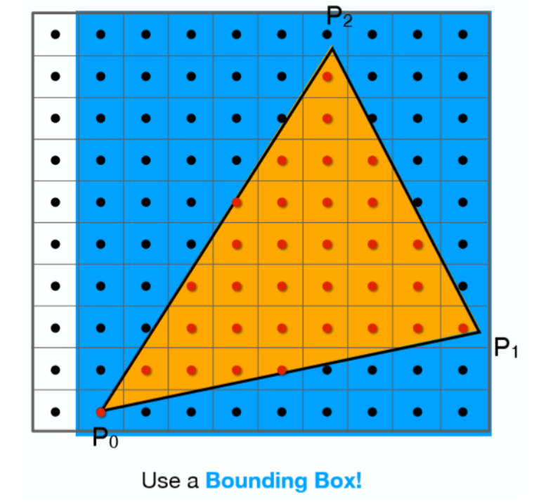
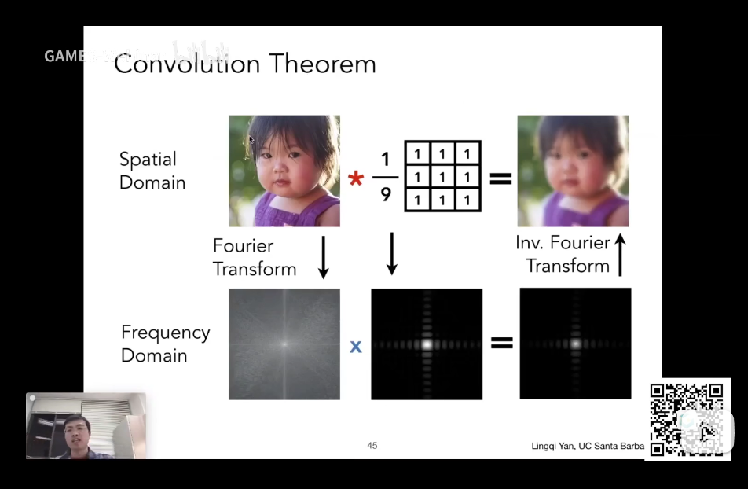
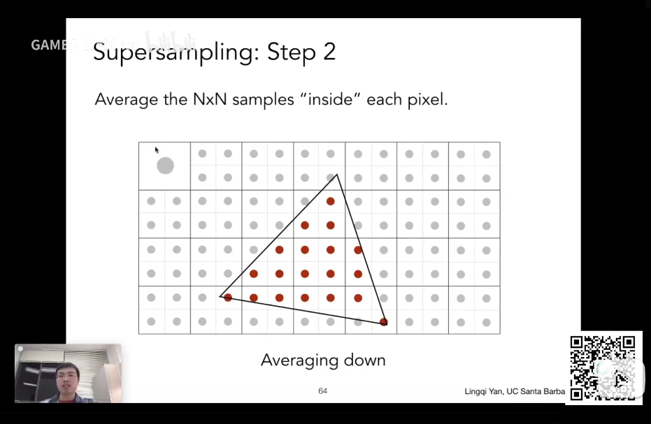

# Rasterization

## Sample



```C++
//Triangle Rasterization
//Get the bounding box that exactly surround the triangle
for(int i=l;i<=r;i++)
    for(int j=t;j<=b;j++)
        if(t.in_the_triangle(i,j))
            color[i][j]=1;
```

# Antialiasing

## 1.Blurring(Pre-filter) $\rightarrow$ Sample

## 2.Convolution
Using the adjacent pixels to get the color of this pixel



## 3.MSAA

Separate the pixel into several small pixels and measure how many small pixels are covered to decide the final color



# Visbility
## Z-Buffering
**Painter's Algorithm**:Paint from back to front, overwrite in the framebuffer, which fails to process complex condition

So now we use the z-buffering way
```C++
for(each Triangle T)
    for(each sample(x,y,z) in T)
        if(z<z-buffering[x][y])
            framebuffer[x][y]=rgb;\\update color
            z-buffering[x][y]=z;\\update depth
```