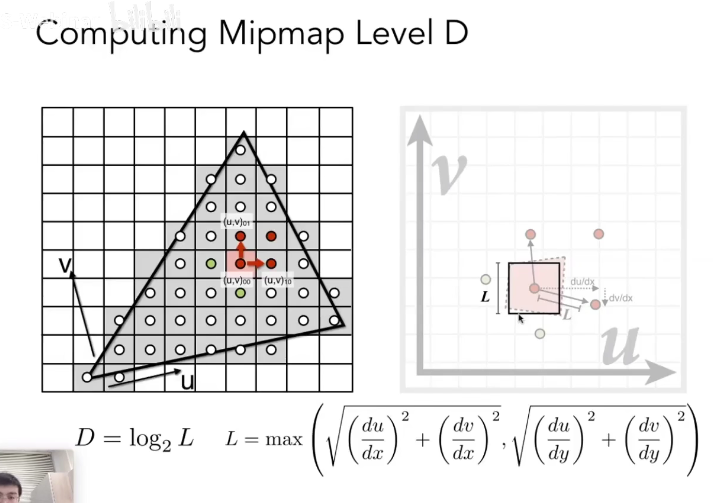

# Shading

The process of applying a material to an obeject

## A Simple Shading Model(Blinn-Phong Reflectance Model)

Perceptual Obeservations:
1.Specular highlights
2.Deffuse reflection
3.Ambient lighting

Shading is local, so that no shadow will be generated.

### Diffuse Reflection

Light is scattered uniformly in all directions

As the light travels in all directions, the intensity will be the same in a spherical surface

If in the surface where diameter is 1 and the intensity is I, then in the diameter=r surface the intensity will be $\frac{I}{r^2}$(4$\pi r^2I^{'}=4\pi I$)

So now we can define the diffusely reflected light L:

$$L_d = k_d (\frac{I}{r^2} max(0,n \cdot I))$$

1.$k_d$ means diffuse coefficient (color)
2.If $n \cdot I<0$ then the point cannot be seen by the eyes

### Specular Term

We can measure whether we can see highlights by this method

The nearer n$\cdot$l to 1,the higher the probability to see the highlight

Why there's an index p? Because int can narrow the reflection lobe, making the scope of angle that is able to see the highlight narrower. P is often set to more than one or two hundred.

### Ambient Term

The object was lightened because of other reflection light instead of the light source

$$L_\alpha = k_\alpha I_\alpha$$

### Blinn-Phong Reflectance Mmodel Formula

Ambient + Diffuse + Specular = Blinn-Phong Reflection

$$L = L_\alpha + L_d + L_s$$

## Shading Frequencies

### Flat Shading

Triangle face is flat -- one normal vector. This method is not good for smooth surfaces

### Gouraud Shading

Interpolate color from vertices across triangle

Each vertex has a normal vector

### Phong Shading
(Not the Blinn-Phong Reflectance Model)

Interpolate normal vectors across each triangle

Compute full shading model at each pixel

**If the geometric figure is very complex, the more simple shading method can also get a good result, and the number of triangles can exceed that of pixel in some conditions**

### Per-vertex Normal Vector

We can infer vertex normals from adjacent triangles: use the average surrounding face normals

$$N_v = \frac{\sum\limits_{i} N_i}{\parallel \sum\limits_{i} N_i \parallel}$$

We can add weights to the normal of triangles according to the area to optimize

## Real-time Rendering (Graphics) Pipeline

**Pipeline**: The process to get the graph

### Shader Programs

Program vertex and fragment processing stages

Describe operation on a single vertex (or fragment)

## Texture Mapping

Definition: Every 3D surface point has a place where it goes in the 2D image, and the image is called texture

### Barycentric Coordinates

A coordinate system for triangles ($\alpha, \beta, \gamma$)

For any point inside the triangle

$$(x,y) = \alpha A + \beta B + \gamma C \\ \alpha + \beta + \gamma = 1$$

**A, B, C are the three vertexes. All three coefficients are non-negative**

The coefficients can also be seen as proportional areas in geometric viewpoint

We can use coordinates to introduce the coordinates

**Barycentric coordinates are not invariant under projection**

### Applying Textures

For example, for each rasterized screen sample (x,y) (usually a pixel's center):

(u,v) = evaluate texture coordinate at (x,y) (using barycentric coordinates)

texcolor = texture.sample(u,v)

set sample's color (usually the diifuse albedo $K_d$ in Blinn-Phong model) to texcolor

### Texture Maginfication

**What if the texture is too small**

Generally insufficient texture resolution is not wanted

If the coordinate we find on the texture is not integer, round it to integer

A pixel on a texture -- a texel

### Bilinear Interpolation

Take four nearest sample locations, with texture values as labeled, and fractional offsets, (s, t) as shown

**Linear Interpolation (1D)**

$$lerp(x, v_0, v_1) = v_0 + x (v_1 - v_0)$$

**Two helper lerps**

$$u_0  = lerp (s, u_{00}, u_{10}) \\ u_1 = lerp (s, u_{01}, u_{11})$$

**Final vertical lerp, to get result**

$$f (x, y) = lerp (t, u_0, u_1)$$

### Bicubic Interpolation

Take sixteen nearest samples

The process is similar to BI

---

**What if the texture is too large**

Their will be serious aliasing

In this case a pixel can cover a large area, cannot find a point to represent it

Supersampling is costly and signal frequency is too large in a pixel, need even higher sampling frequency

**We just need to get the average value within a range instead of sampling**

### Mipmap

Allowing fast, approximate, square range queries

A n*n image will have logn layers, and the stroage space will increase by 1/3

#### Computing Mipmap Level D

$$D = log_2 L$$

$$L = max (\sqrt{(\frac{du}{dx})^2 + (\frac{dv}{dx})^2}, \sqrt{(\frac{du}{dy})^2 + (\frac{dv}{dy})^2} )$$

Then D will determine the texture layer you use

If D is not an integer we use interpolation

**Mipmap Limitations**

Overblur: The pixel far away will be vague

We can use **anisotropic filtering** to solve it partly

### Anisotropic Filtering

#### Ripmaps And Summed Area Tables

The length-width ratio will not be limited

#### EWA Filtering

The rectangle is split into circles

### Bump Mapping

Adding surface detail without adding more triangles

Perturb surface normal per pixel

Height shift per texel defined by a texture

**c is an influence coefficient, h is the color of texture gotten according to u,v**

2D:

3D:

Orignial normal $n(p) = (0, 0, 1)$

Derivatives at p are:

$$\frac{\partial p}{\partial u} = c_1 * [ h(u+1) - h(u) ]\\ \frac{\partial p}{\partial v} = c_2 * [ h(u+1) - h(u) ]$$

The new normal is:

$$ n = ( -\frac{\partial p}{\partial u}, -\frac{\partial p}{\partial v}, 1)$$

## Displacement Mapping

More advanced than bump mapping

It uses the same texture as in bumping mapping and actually moves the vertices

