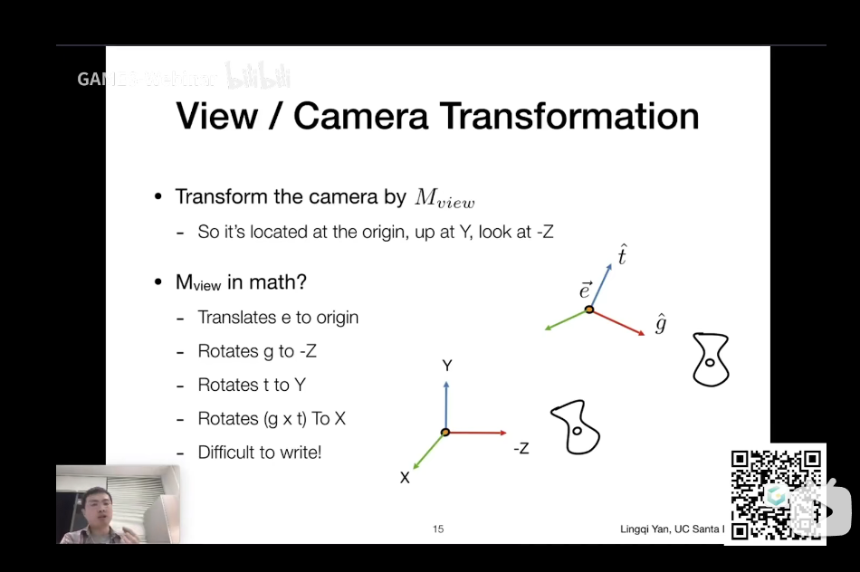
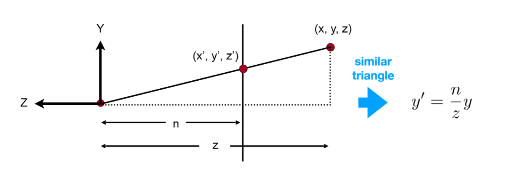

# Class 1-4

## Basic Transformation

### 3-D rotation

$$rotata-z(\phi)=\left[\begin{matrix}cos\phi & -sin\phi & 0\\sin\phi & cos\phi & 0\\0 & 0 & 1\end{matrix}\right]$$

$$rotata-x(\phi)=\left[\begin{matrix}1 & 0 & 0\\0 & cos\phi & -sin\phi\\0 & sin\phi & cos\phi\end{matrix}\right]$$

$$rotata-y(\phi)=\left[\begin{matrix}cos\phi & 0 & sin\phi\\0 & 1 & 0\\-sin\phi & 0 & cos\phi\end{matrix}\right]$$

because we make z rotates to x the y-rotation is different

### Transformation Expansion

Because of translation transformation we need to expand one dimension

$$\left[\begin{matrix} 1 & 0 & 1 \\ 0 & 1 & 1 \\ 0 & 0 & 1 \end{matrix}\right]\left[\begin{matrix} 1\\ 0 \\ 1 \end{matrix}\right]=\left[\begin{matrix}2\\1\\1\end{matrix}\right]$$

The x and y all move 1 in this example

### Rodrigues Transformation

We can use this transformation to rotate by any given axis

$$R=cos\theta*I+(1-cos\theta)\left[\begin{matrix}k1\\k2\\k3\end{matrix}\right] \left[\begin{matrix}k1&k2&k3\end{matrix}\right]+sin\theta\left[\begin{matrix}0 & -k3 & k2\\k3 & 0 & k1\\-k2 & k1 & 0\end{matrix}\right]$$
## Viewing Transformation

### 1.Modeling Transformation

The combination of basic transformations(translation,rotation,scaling,shearing)

### 2.View\Camera Transformation

We need to remove the camera to the global origin

1.Move the camera to the origin

$$T=\left[\begin{matrix}1 & 0 & 0 & -x_e\\0 & 1 & 0 & -y_e\\0 & 0 & 1 & -z_e\\0 & 0 & 0 & 1\end{matrix}\right]$$

2.Modify the angle to make three vectors corresponding to three axes

As the transformation is difficult, we can think of the inverse transformation first

$$R_{view}^{-1}=\left[\begin{matrix}x_{\hat{g} \times \hat{t}} & x_t & x_{-g} & 0\\ y_{\hat{g} \times \hat{t}} & y_t & y_{-g} & 0\\z_{\hat{g} \times \hat{t}} & z_t & z_{-g} & 0\\0 & 0 & 0 & 1\end{matrix}\right]$$

so that the orginial matrix is

$$R_{view}=\left[\begin{matrix}x_{\hat{g} \times \hat{t}} & y_{\hat{g} \times \hat{t}} & z_{\hat{g} \times \hat{t}} & 0\\  x_t & y_t & z_t & 0\\ x_{-g} & y_{-g} & z_{-g} & 0\\0 & 0 & 0 & 1\end{matrix}\right]$$

The final result is

$$V=R_{view}T$$

## 3.Projection Transformation

### 3.1 Orthographic Projection Transformation

$$M_{ortho}=\left[\begin{matrix}\frac{2}{r-l} & 0 & 0 & 0\\ 0 & \frac{2}{t-b} & 0 & 0\\ 0 & 0 & \frac{2}{n-f} & 0\\0 & 0 & 0 & 1\end{matrix}\right]\left[\begin{matrix} 1 & 0 & 0 & -\frac{r+l}{2}\\ 0 & 1 & 0 & -\frac{t+b}{2}\\ 0 & 0 & 1 & -\frac{n+f}{2} \\0 & 0 & 0 & 1\end{matrix}\right]$$

### 3.2 Perspective Projection Transformation

Now we can get the intial  vector

$$M_{persp \rightarrow ortho} \left[\begin{matrix}\ x \\ y \\ z \\ 1\end{matrix}\right]=\left[\begin{matrix}\ \frac{nx}{z} \\ \frac{ny}{z} \\ unknown \\ 1\end{matrix}\right]==\left[\begin{matrix}\ nx \\ ny \\ unknown \\ z\end{matrix}\right]$$

Then we know that:
1.The coordinate on near plane will not change
2.The z on far plane will not change

Then we can know the intinal matrix:

$$M_{persp \rightarrow ortho}=\left[\begin{matrix}n & 0 & 0 & 0\\ 0 & n & 0 & 0\\ 0 & 0 & A & B\\0 & 0 & 1 & 0\end{matrix}\right]$$

An+B=$n^2$
Af+B=$f^2$

$$M_{persp \rightarrow ortho}=\left[\begin{matrix}n & 0 & 0 & 0\\ 0 & n & 0 & 0\\ 0 & 0 & n+f & -fn\\0 & 0 & 1 & 0\end{matrix}\right]$$

